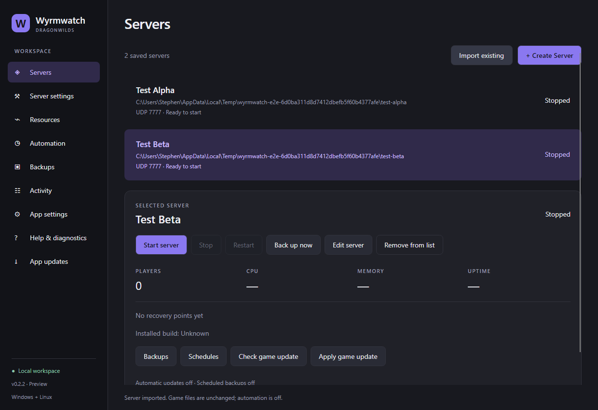
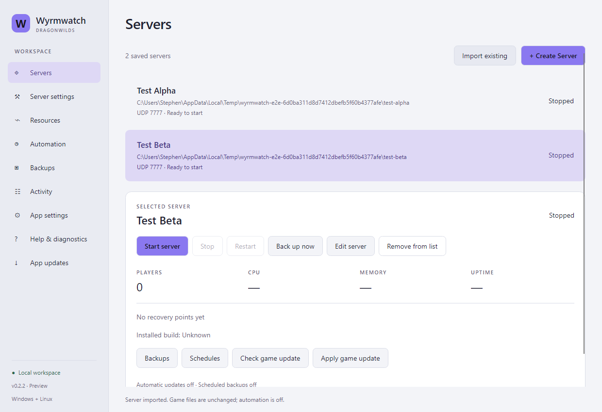

# Wyrmwatch

[](https://github.com/stephenjarrett/Wyrmwatch/actions/workflows/build.yml)

A focused desktop manager for RuneScape: Dragonwilds dedicated servers. Built in C# on .NET 10 and Avalonia, with Windows and Linux interfaces from one codebase.

[**Download for Windows & Linux**](https://github.com/stephenjarrett/Wyrmwatch/releases/latest) · [Installation guide](docs/installing.md) · [Import an existing server](#use-an-existing-server) · [Contribute](CONTRIBUTING.md)

An unofficial community tool, not affiliated with Jagex. Licensed [AGPL-3.0-only](LICENSE).



*Avalonia-rendered screenshots from the 0.2.2 end-to-end test workspace. These are dummy servers; no live game data is shown.*

<details>
<summary><strong>Light theme</strong></summary>



</details>

## Features

- Servers workspace with a saved-server list, CPU/memory graphs, free disk space, dark/light/system themes.
- Import existing installations in place with a save-folder review; choose from saved server connections and run one at a time.
- Create servers with a guided setup: suggested folders, owner ID help, generated admin password, and a review before the SteamCMD download.
- Start, graceful stop, restart, and per-installation process tracking.
- Compare installed and available Steam builds before updating.
- Automatic updates wait for a continuously observed empty server for 60 seconds. Unknown player activity defers maintenance. Optional daily maintenance window.
- Scheduled and manual ZIP backups of the selected Saved/SaveGames and Saved/Config folders, SHA-256 verification, and per-profile retention.
- Guided restore: verify, back up the current state, stage files, retain previous folders, and leave the server stopped.
- Persisted operation history, a filterable game-log viewer, read-only diagnostics, and official setup help.
- Launch at login, Windows close-to-tray, and an opt-in background manager that continues schedules after the desktop closes.
- Optional Windows service and Linux user-service setup for unattended operation.
- Manual checks for new Wyrmwatch releases, SHA-256-verified downloads, and switching to a staged version while retaining the previous app.
- Import/export community language packs with English fallback, without replacing focused forms.
- Disconnect saved server connections without deleting their installation, saves, or backups.

Automatic game updates, scheduled backups, and background operation start **off**. Opening the app never adopts, installs, launches, or stops an unconfigured game server. Remove from list disconnects a server without deleting its files.

## Use an existing server

1. Choose **Import existing** on Servers. Paste its installation folder into the dialog or use **Choose server folder…**. You can also paste the full launcher path (`RSDragonwildsServer.exe` on Windows, the server launch script on Linux) directly into the text field. Click **Review folders**; the launcher is read, never executed.
2. Review the detected **save-data folder**, listed world saves, and backup destination. The default is `RSDragonwilds/Saved` inside the installation. For a server that already saves elsewhere, expand **Advanced save location**, enable **Use a different existing Saved folder**, and locate its actual folder. This selects existing data; it does not relocate files or change where the game writes them. Wyrmwatch reads the existing server name and port from that folder's configuration.
3. Confirm the reviewed Saved folder and choose **Import server**, then create a manual backup. Importing only saves a connection: it does not move files, rewrite game configuration, install, launch, or stop a server. Automatic updates and backups are disabled on import, including reconnection.
4. Enable schedules when ready. Run only one server-management application with automatic maintenance enabled for the installation.

For a fresh world, choose **Create Server** on Servers. The wizard suggests server/world names, UDP port 7777, separate install and backup folders, and a generated admin password. Paste your Dragonwilds Player ID from the bottom of the in-game Settings menu; optionally set a world password for your players. You can select a populated parent such as `C:\Games`: Wyrmwatch uses a new dedicated child folder and rejects an occupied destination. Saves stay in that server's `RSDragonwilds/Saved` folder automatically; no separate save-location choice is required. Installation and save paths are read-only in Server settings. Review all paths and confirm **Create Server** to download and configure the server. It stays stopped until you press **Start**. Automatic updates and scheduled backups remain off until you enable them.

A server started elsewhere can be monitored and backed up. Wyrmwatch will not send it shutdown signals without a recorded owned process identity. Stop it using its existing controls at a convenient time, then start it through Wyrmwatch for managed shutdown. No forced-stop fallback is enabled.

Keep as many saved server connections as needed, and choose one from the list. Selecting an entry changes the view; it does not start it or stop the current server. Stop the running server before starting another. Desktop actions and maintenance restarts all check the other saved connections immediately before launching; unknown process status blocks a start. Disconnecting a running connection does not bypass this check. These safeguards apply to connections known to this workspace, including disconnected entries; Wyrmwatch does not control other manager workspaces or unconfigured installations.

Saved servers may reuse the same game port because Wyrmwatch runs one at a time. Keep separate installation and save-data folders for each connection. Overlapping game/save paths remain blocked, and backups must stay outside every connected server's game/save folders. A common external backup destination is allowed because archives are scoped to their server. Maintenance actions run one at a time across the manager, and updating a stopped server leaves it stopped.

Config edits require the server to be stopped, preserve unrelated sections/admin lists, and retain the previous file. Read the [official Dragonwilds server guide](https://runescapedragonwilds.help.jagex.com/hc/en-gb/articles/45365343055249-Dedicated-Servers-How-to-Guide) for owner IDs, networking, world saves, and game-side administration. The game chooses the newest save; restore moves the old active save folder into a retained recovery directory so newer saves do not override the selected recovery point.

## Run

Download the [latest release](https://github.com/stephenjarrett/Wyrmwatch/releases/latest). Windows has a per-user setup `.exe`; Ubuntu/Debian has a `.deb` package. Portable ZIP and TAR downloads remain available. See [installation, upgrades, and removal](docs/installing.md).

The portable builds include one .NET runtime shared by the desktop and background manager, so no separate .NET installation is needed. Debugging symbols are excluded from downloads. Extract the entire build folder; do not copy just the executable.

Windows: run `Wyrmwatch.exe`. Linux desktop: `chmod +x Wyrmwatch agent/Wyrmwatch.Agent`, then `./Wyrmwatch`. Linux requires an X11/XWayland desktop and the [Avalonia system dependencies](https://docs.avaloniaui.net/docs/supported-platforms). SteamCMD requires its distribution-specific 32-bit runtime libraries. Linux builds are provided as previews until verified with a real Linux game installation.

Command-line options:

```text
--demo                Illustrative dashboard; server actions disabled
--data-dir PATH       Separate manager preferences/history (not a server sandbox)
--minimized           Start minimized
```

Manager preferences and operation history are stored in the platform's local application-data directory under `Wyrmwatch`. Server connections are configured explicitly. The desktop starts a separate background manager for the workspace and connects over an authenticated loopback endpoint. Only one manager can own a workspace.

See [background operation](docs/background.md) for service setup. See [app updates and language packs](docs/updates-and-languages.md) for the update workflow and translation templates.

## Maintenance and recovery limits

Schedules need the computer awake and the background manager running. By default it exits with the desktop. Enable **Keep the background manager running** under App settings and save desktop preferences to continue after closing the window. A registered service or explicitly started standalone agent runs independently. Missed jobs run once after the manager returns. Closing the manager leaves the game running.

Live backups contain files already written to disk; they cannot capture unsaved in-memory progress. Updates take a second backup after shutdown. Backups are stored outside the installation. Only Wyrmwatch-marked archives for the same profile and installation are pruned; recovery folders are never automatically deleted. Keep an additional backup on a separate drive.

Player counts are inferred conservatively from the current session's Unreal log. Missing startup markers, an unreadable/oversized log, or unmatched leave events defer automatic updates. An external start or new player can still race the final state check; the game does not expose a transactional maintenance lock.

On Windows, an isolated helper verifies the target process identity and console members before sending Ctrl+C. Linux uses SIGINT only for recorded owned game processes. If graceful shutdown fails, maintenance stops. A failed install or build verification leaves the server stopped for investigation.

Backups include configuration passwords. Keep the workspace and backup folder private. Wyrmwatch never changes firewall or router rules. The manager API only listens on the local loopback interface. Remote control is unavailable; legacy access settings are ignored and preserved.

## Development

Install the [.NET 10 SDK](https://dotnet.microsoft.com/download/dotnet/10.0).

```powershell
dotnet build Wyrmwatch.slnx
dotnet test tests/Wyrmwatch.Core.Tests
dotnet test tests/Wyrmwatch.Desktop.Tests
dotnet run --project src/Wyrmwatch.Desktop -- --demo
./scripts/build.ps1 -Runtime win-x64
./scripts/build.ps1 -Runtime linux-x64
```

Focused checks cover backup integrity and restore preservation, update failures and deferral, configuration preservation, a disposable Windows console shutdown, local API authentication, background lifecycle, app-package integrity, desktop navigation/theme/language flows, and UI-to-API create/import/edit/start/stop/backup/restore/remove workflows with dummy Steam and game adapters. Native OS folder pickers, actual Steam downloads and game-engine behavior require separate live validation. All game-data fixtures are temporary. No tests use a real server. GitHub Actions runs the same checks and packages both targets. Publishing a `v*` tag invokes the release workflow; it rejects a tag that does not match the project version.

`Wyrmwatch.Core` is independent of the UI. `Wyrmwatch.Platform` contains both process adapters (Windows and Linux); `Wyrmwatch.Signal` is the Windows console helper. `Wyrmwatch.Agent` runs local maintenance. `Wyrmwatch.Desktop` contains the Avalonia interface. Linux desktop, package, service restart, and process control checks run against disposable fixtures; actual game hosting still requires separate validation.

## License and contributions

Wyrmwatch is open source under the [GNU Affero General Public License, version 3](LICENSE) (`AGPL-3.0-only`). You may use, modify, fork, and redistribute it, including commercially, subject to the license's source-sharing and notice requirements. See [NOTICE](NOTICE) for the copyright and license grant.

Anyone can contribute through issues and pull requests; see [CONTRIBUTING.md](CONTRIBUTING.md). Contributions back to this repository are encouraged, not required by the license. Distributing covered binaries requires providing the corresponding source under the AGPL's terms. If you modify the program and let users interact with it remotely over a network, section 13 requires offering those users the corresponding source. Third-party components retain their [own licenses](THIRD-PARTY-NOTICES.md).

Portable builds include `Wyrmwatch-source.zip` containing the project source and build scripts, plus `SOURCE.md` with the build revision. The application is provided without warranty.
